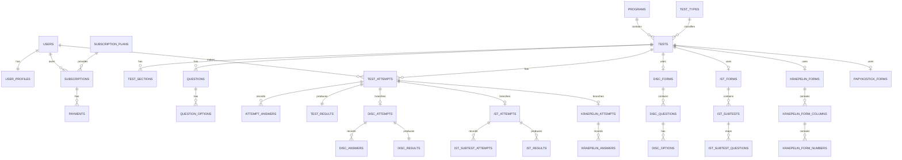

# ERD SaaS CPNS & BUMN

> High-level Entity Relationship Diagram untuk platform SaaS latihan tes CPNS/PNS dan BUMN.

---

# 1. Overview

Sistem dibagi menjadi 5 domain utama:

1. User & Access
2. Billing & Subscription
3. Program & Catalog
4. Test Engine
5. Specialized Psychotest Modules

---

# 2. ERD High Level

```text
┌──────────────────────┐
│        users         │
└─────────┬────────────┘
          │ 1
          │
          │ 1
┌─────────▼────────────┐
│    user_profiles     │
└──────────────────────┘

┌──────────────────────┐
│ subscription_plans   │
└─────────┬────────────┘
          │ 1
          │
          │ N
┌─────────▼────────────┐
│    subscriptions     │
└─────────┬────────────┘
          │
          │ N
┌─────────▼────────────┐
│      payments        │
└──────────────────────┘

┌──────────────────────┐        ┌──────────────────────┐
│      programs        │        │      test_types      │
└─────────┬────────────┘        └─────────┬────────────┘
          │ 1                              │ 1
          │                                │
          │ N                              │ N
          └──────────────┬─────────────────┘
                         ▼
                 ┌────────────────┐
                 │     tests      │
                 └───────┬────────┘
                         │
            ┌────────────┼────────────┐
            │            │            │
            ▼            ▼            ▼
   ┌──────────────┐ ┌──────────────┐ ┌──────────────┐
   │ test_sections│ │  questions   │ │ test_attempts│
   └──────────────┘ └──────┬───────┘ └──────┬───────┘
                           │                │
                           ▼                ▼
                  ┌────────────────┐ ┌──────────────┐
                  │question_options│ │attempt_answers│
                  └────────────────┘ └──────┬───────┘
                                            ▼
                                    ┌──────────────┐
                                    │ test_results │
                                    └──────────────┘
```

---

# 3. Specialized Module ERD

## 3.1 DISC

```text
tests
  │ 1
  ▼
disc_forms
  │ 1
  ▼
disc_questions
  │ 1
  ▼
disc_options

test_attempts
  │ 1
  ▼
disc_attempts
  │ 1
  ├──────► disc_answers
  └──────► disc_results
```

## 3.2 IST

```text
tests
  │ 1
  ▼
ist_forms
  │ 1
  ▼
ist_subtests
  │
  └──────► ist_subtest_questions ──────► questions

test_attempts
  │ 1
  ▼
ist_attempts
  │ 1
  ├──────► ist_subtest_attempts
  └──────► ist_results
```

## 3.3 Kraepelin

```text
tests
  │ 1
  ▼
kraepelin_forms
  │ 1
  ▼
kraepelin_form_columns
  │ 1
  ▼
kraepelin_form_numbers

test_attempts
  │ 1
  ▼
kraepelin_attempts
  │ 1
  └──────► kraepelin_answers
```

## 3.4 Papikostick

```text
tests
  │ 1
  ▼
papikostick_forms
  │ 1
  ├──────► papikostick_items
  │           │
  │           └──────► papikostick_item_options
  │
  └──────► papikostick_dimensions

test_attempts
  │ 1
  ▼
papikostick_attempts
  │ 1
  ├──────► papikostick_answers
  └──────► papikostick_results
```

---

# 4. Relasi Inti

## User Domain
- `users.id` → `user_profiles.user_id`
- `users.id` → `subscriptions.user_id`
- `users.id` → `payments.user_id`
- `users.id` → `test_attempts.user_id`

## Billing Domain
- `subscription_plans.id` → `subscriptions.subscription_plan_id`
- `subscriptions.id` → `payments.subscription_id`

## Catalog Domain
- `programs.id` → `tests.program_id`
- `test_types.id` → `tests.test_type_id`
- `programs.id` → `test_packages.program_id`

## Generic Test Engine
- `tests.id` → `test_sections.test_id`
- `tests.id` → `questions.test_id`
- `questions.id` → `question_options.question_id`
- `tests.id` → `test_attempts.test_id`
- `test_attempts.id` → `attempt_answers.test_attempt_id`
- `test_attempts.id` → `test_results.test_attempt_id`

---

# 5. Rekomendasi Visual ERD Lanjutan

Untuk visual diagram yang lebih formal, saya sarankan dibuat lagi di:
- dbdiagram
- draw.io
- Lucidchart
- Mermaid ER diagram

---

# 6. Mermaid Draft



---

# 7. Notes
Dokumen ini adalah ERD tingkat tinggi. Untuk implementasi migration, gunakan dokumen:
- `laravel-migration-plan.md`